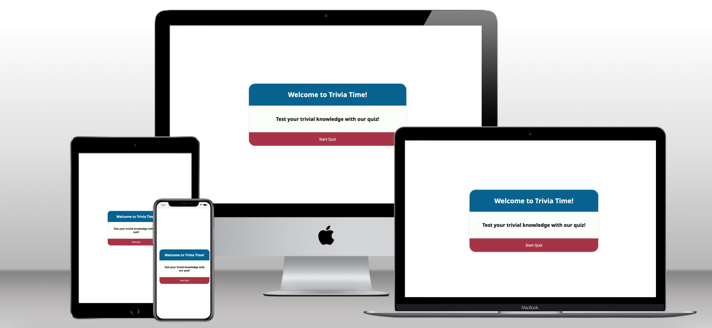
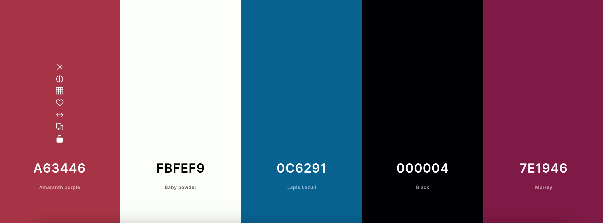
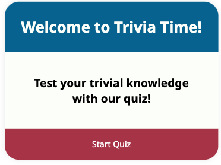
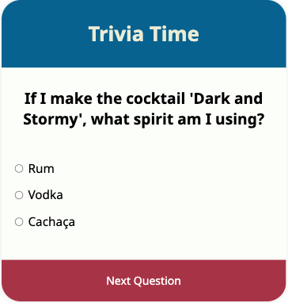
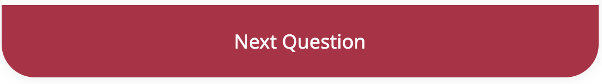
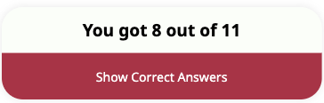
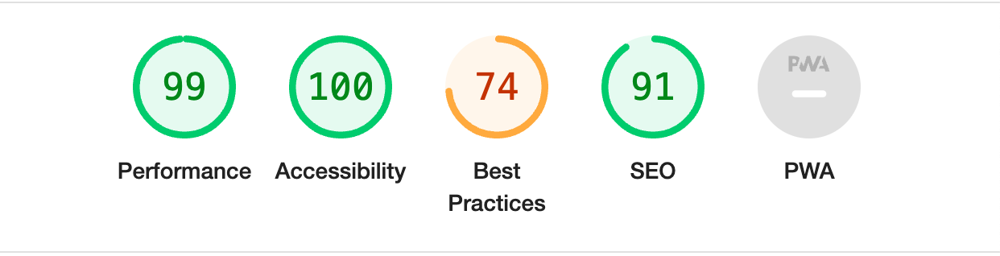
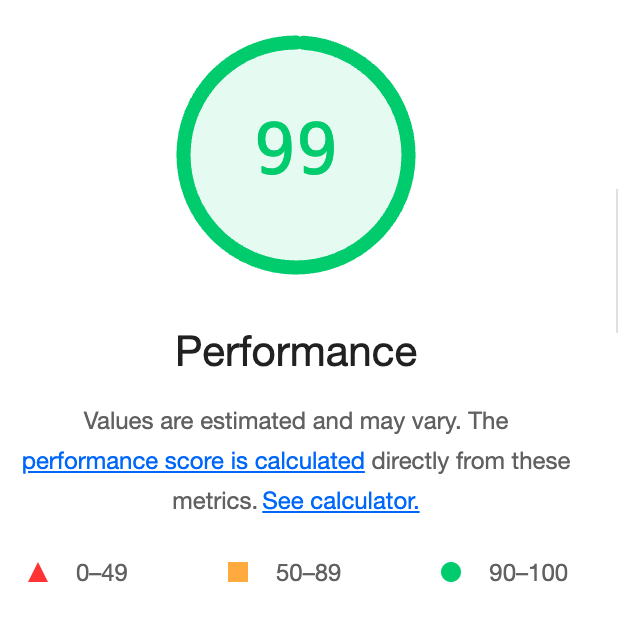

# Trivia Time 

The Trivia Time application is a simple quiz application that is designed to allow the user to test their trivial knowledge with a variety of questions. The application involves the functions of starting the quiz, answering questions from multiple options and to see their score along with the correct answers at the end of the quiz. It is a front-end application built with HTML, CSS and JavaScript. 

[Link to website for Trivia Time quiz](https://hebjornberg.github.io/quiz/)

### Table of Content 

+ [UX](#ux "UX") 
  + [Site Purpose](#site-purpose "Sire Purpose")
  + [Site Goal](#site-goal "Site Goal")
  + [Audience](#audience "Audience")
  + [User Goal](#user-goal "User Goal")
+ [Design](#desig "Design")
  + [Color Scheme](#color-scheme "Color Scheme")
  + [Typography](#typography "Typography")
+ [Features](#features "Features")
  + [Landing Page](#landing-page "Landing Page")
  + [Questions](#questions "Questions")
  + [Next Question](#next-question "Next Question")
  + [Score](#score "Score")
  + [Correct Answers](#show-correct "Show Correct") 
  + [Back to Start](#back-to-start "Back to Start")
+ [Testing](#testing "Testing")
  + [JavaScript](#javascript "JavaScript")
  + [Validation](#validation "Validation")
  + [Lighthouse](#lighthouse "Lighthouse")
  + [Bugs](#bugs "Bugs")
+ [Deployment](#deployment "Deployment")
+ [Credits](#credits "Credits")

## UX

### Site Purpose 

Trivia Time is an application with the purpose of entertaining the user with some trivial knowledge. 

### Site Goal 

The goal of the application is to challenge the user with questions, while awakening an interest to learn some more trivial knowledge. 

### Audience

Anyone that is interested in random facts or trivial knowledge can use this application. As it is multiple choice, there is always the option to guess. The target audience would be for adults. 

### User Goal

For the user to increase their knowledge from the questions being asked. To get caught up in the game, along with learning new knowledge at the end of the game. 

---

## Design

### Color Scheme 

The color scheme was generated at [Coloors.co](https://coolors.co/) and chosen as it created a clear, visible contrast that makes the quiz application accessible yet attractive and engaging. 

Lapiz Lazuli: #0C6291
Baby powder: #FBFEF9
Amaranth purple: #A63446
Murrey: #7E1946
UP Forest Green: #014421

### Typography 

The font chosen for Trivia Time is 'Noto Sans' as it is a visually appealing font, that does not distract from the content of the questions. 

[Find font here](https://fonts.google.com/share?selection.family=Noto+Sans:ital,wght@0,100..900;1,100..900)

## Features 

### Landing Page

The landing page features a heading with the text Trivia Time, and a welcome text to try out the quiz. 
It also features a "Start Quiz"-button, which when clicked directs you to the first question of the quiz. 

### Questions 

Every question has three options with radio buttons. You can only select one option per question. 

### Next Question 

When you have selected an answer, you click the "Next Question"-button to move to the next question. This button only works and will take you onward if you have selected an answer. 

### Score

When you have finished all the questions, the score you have accumulated will appear. As you move through the questions, the application increments your score if you choose the correct option. When you click the "Show Correct Answers"-button, you will be redirected to a page showing the correct answers. 

### Correct Answers

When clicking the "Show Correct Answers"-button displayed with the score, you get directed to all the questions being displayed with the options. Next to the correct answers is a checkmark, to mark with option was the correct one. 
In case the user selected a wrong answer, a red cross appears to the selected answer, and the checkmark for the correct answer indicates the correct answer in the same question. The "Show Correct Answers"-feature is a way to visualise the whole quiz, but also a way for the user to learn new facts if they didnt already know the answer to the question. 

### Back to Start 

Underneath the correct answers, there is the "Back to Start"-button. When clicked, it directs the user back to the start of the quiz, if they want to try it again. 

## Testing 

### JavaScript

When the script was put through Jshint, no warnings appeared that affects the applications performance. 

### Validation 

The HTML and CSS has been validated using the W3C-validator, no warnings were issued. 

### Lighthouse 

When doing a Lighthouse evaulation of the website through DevTools, the following was the result. 

### Bugs 

When first deploying the Trivia Time-quiz, the incorrect answers were not marked and made it look odd when showing the correct answers as the red crossmark appeared next to questions which the user had not selected. This was due to faulty logic in the function for showing the cross mark, and was resolved. 

## Deployment 

The site was deployed through GitHub by the following steps: 

1. Through the repository, navigate to Settings. 
2. Go to Pages in the left-hand menu. 
3. Choose Source "Deploy from branch". Chose Branch "main" and click save. 
4. The page is now being deployed and will appear with a live link by your repository.
5. The link to the live site can be found here [Trivia Time](https://hebjornberg.github.io/quiz/)

## Credits 

- The structure and the layout originally came from a tutorial created by Coding With Nick. The source code from the tutorial can be found here [Create a Quiz App with HTML, CSS & JavaScript](https://codingwithnick.in/create-a-quiz-app-using-html-css-javascript/)
- The code has since been altered to fit the the idea of this project and have additional functionality
- I want to add an additional thank you to the Code Institute Slack-community #community-sweden 
for support and assistance throughout the project, including the README-section

