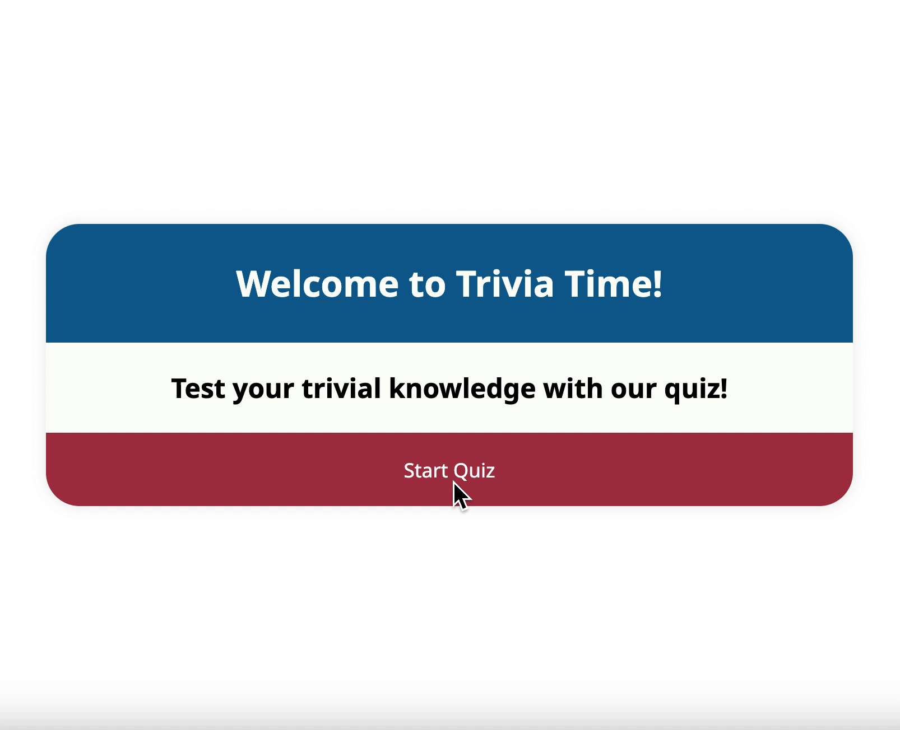

# Manual Testing of Trivia Time

Landing Page - Start Quiz

 

<b>Start Quiz</b>

When clicking the "Start Quiz"-button, you get redirected to the first question of the quiz.

Landing Page - Start Quiz

 

<b>Start Quiz</b>

When clicking the "Start Quiz"-button, you get redirected to the first question of the quiz.

This was tested by clicking the button to see that it redirects you to the quiz.html. 

- Landing page - index.html
- Questions - quiz.html

Options and Next Question

 

<b>Options and Next Question</b>

When faced with the questions, you have three options. If the user hasn't chosen an option, it won't be possible to move on to the next question. This was tested by choosing an option and moving to the next question, as well as trying to click on the "Next Question"-button without choosing an option. 

Timer

 

<b>Timer</b>

For every question there is a 30 second time limit. If an option hasn't been chosen before the time is up, the application moves on to the next question, regardless if you have chosen an answer or not. 

Show Correct Answers, Time taken, Back To Start

 

<b>Show Correct Answers</b>

When finishing the quiz, your result will show up in the form of "You got x out of 11". Underneath is the button "Show Correct Answers". When clicked, the correct answers will appear. If you have chosen the correct answer to a question, only the black tick will appear indicating that you got the correct answer. If you have chosen the incorrect answer, a red cross indicates which answer you choose, along with the black tick indicating the correct option. 

<b>Time Taken</b>

Underneath all the options is the "Time taken" which indicates how long it took the user to complete the quiz. 

<b>Back To Start</b>

If the user would want to retake the quiz, there is a button at the bottom of the application that will redirect the user back to the landing page. 

